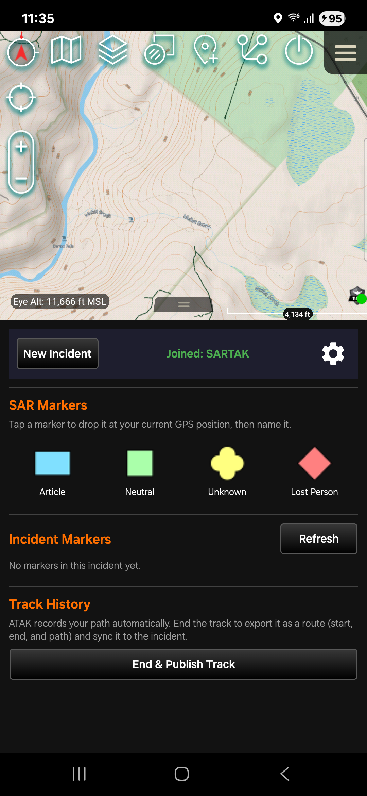
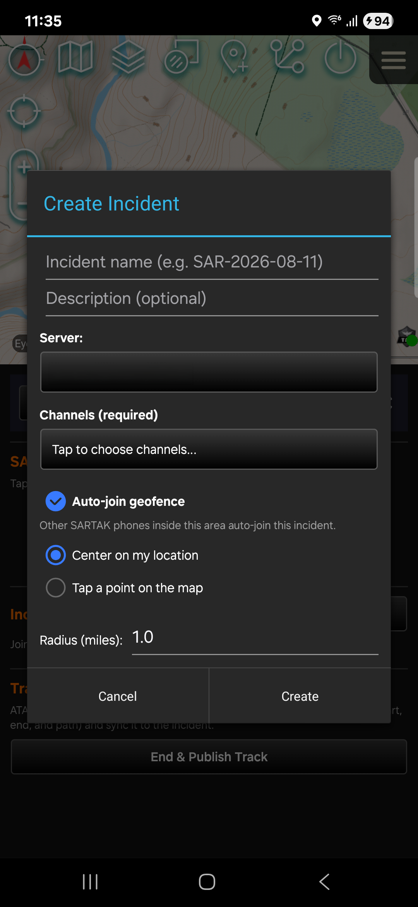
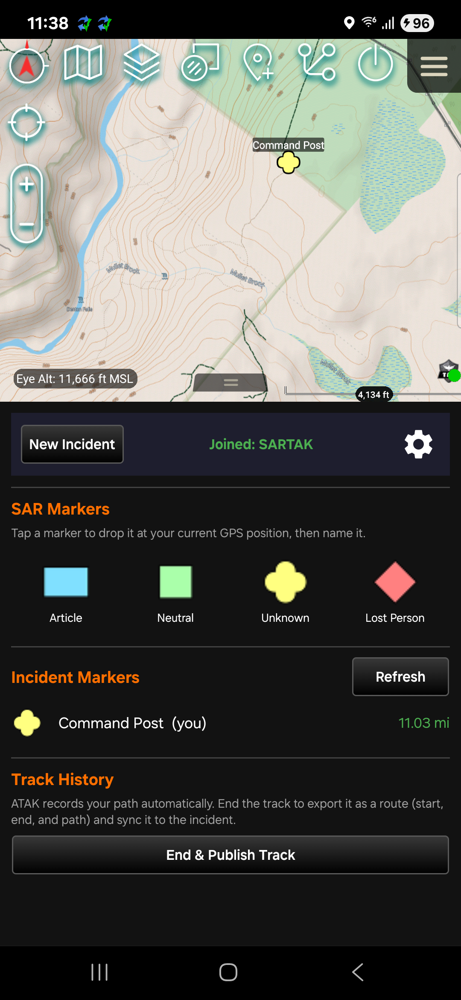
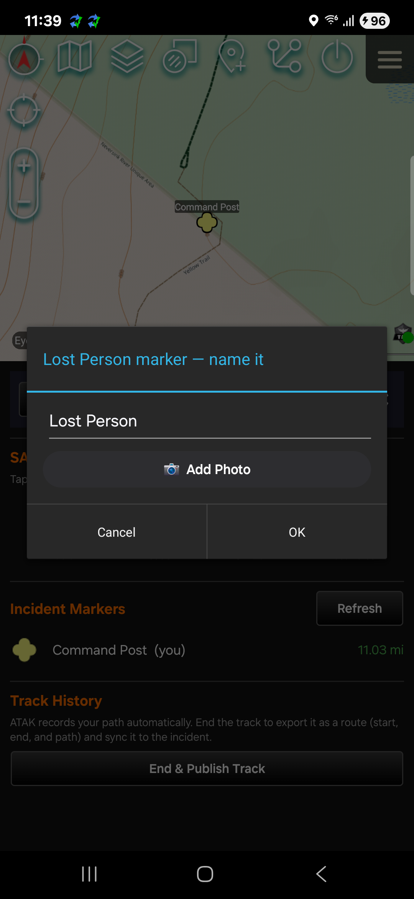

# SARTAK — Search & Rescue Toolkit for ATAK

SARTAK is an ATAK plugin that streamlines the most common Search-and-Rescue
workflows on a TAK Server, so field teams can share markers, photos, and tracks
without needing to know ATAK's underlying data-sync mechanics.

A SAR incident lives on the server as a shared **Incident** (TAK Data Sync
mission). One person creates it; everyone else joins — or auto-joins by location —
and from then on every marker, photo, and track is kept in sync across the team.

---

## Features

- **Incidents (shared data sync)**
  - Create an incident scoped to one or more channels, on any connected server.
  - Browse, join, and leave incidents from the incident manager.
  - Delete an incident from the server (creator only).
  - **Geofence auto-join** — draw a radius around the incident, and any teammate's
    SARTAK phone inside that area joins automatically. No manual subscribing.
  - **Multi-server** — see and work incidents across every TAK server you're
    connected to, each tagged by server.

- **SAR markers** — one-tap drop of the four standard affiliations
  (Article, Neutral, Unknown, Lost Person) at your current GPS position, each
  named in a quick popup and optionally photographed. Markers auto-sync to the
  incident.

- **Photos** — capture a photo at drop time; it attaches to the marker and syncs
  to the incident so the whole team receives it. View any marker's photo in-app,
  and show the **camera direction (field of view)** on the map when the photo
  recorded a heading.

- **Incident markers list** — a live, distance-sorted (imperial) roster of every
  marker in the incident, yours and your teammates'. Tap one to center the map on
  it.

- **Track History** — end ATAK's auto-recorded track and publish it as a native
  TAK **route** (start, end, and the full path) to the incident.

Everything syncs both ways, and deletions propagate to and from the whole team.

---

## Screenshots

| Main pane | Create incident |
|---|---|
|  |  |

| Incident markers | Drop & name a marker |
|---|---|
|  |  |

---

## Install

1. Download the latest APK from the [Releases](../../releases) page.
2. Install it on a device that already has **ATAK-CIV 5.6** and is connected to a
   TAK Server.
3. Enable the plugin in ATAK (Settings → Tool Preferences → Plugins), then tap the
   SARTAK toolbar button.

Requires ATAK-CIV 5.6.x.

---

## About

SARTAK is developed by **R3 Systems** for Sullivan County Search & Rescue
operations.

Distribution Statement A. Approved for public release: distribution unlimited.
